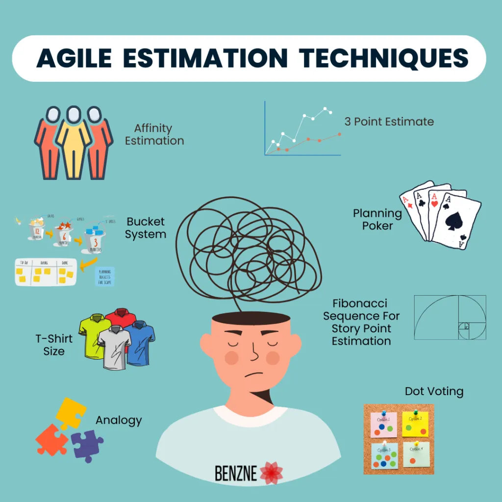

# 📘 Task Estimation in Scrum

## Introduction
Estimating tasks is a crucial part of the development process. There are many techniques (), but while the goal of task estimation is to help teams efficiently plan and execute the sprint, sometimes difficulties and complications can occur. Many of the developers express their frustration with traditional estimation techniques, particularly story points, which are often seen as unreliable and wasteful. 

  
**Description:** Various techniques for task estimation

Given the fast-paced nature and agility of our startup, we need a simple and efficient estimation method that balances accuracy with agility. Based on developer feedback, we set on the T-shirt sizing as our standardized estimation technique.

## 🛠️ &nbsp;Implementation Guide
Here is how we recommend implementing this approach in our workflow:
- ✅ &nbsp;Add step 
- ✅ &nbsp;Add step
- ✅ &nbsp;Add step
- ✅ &nbsp;Add step
- ✅ &nbsp;Add step

## 🚫 &nbsp;Common Pitfalls
- ❌ Assigning sizes without team discussion - if just one person is involved in the task measurement, the estimation may be inaccurate
- ❌ Skipping comparison to previous experiences - remember to look back and reference 
- ❌ Assuming T-shirt sizes map directly to hours - trying to convert sizes to exact time estimates defeats the purpose of relative sizing

## 🖼️ &nbsp;Diagrams / Visuals 
Add diagrams/visuals here if it helps explain key points.
> 💡 To Note: If appliable, add your images to img folder and paste the path below for each image. Add [Alt Text] to show image descp if image fails to show. If not applicable, please delete this section!

### 📌 [Diagram 1 Title]  
  
**Description:** One-line (approx) summary of what the visual represents

### 📌 [Diagram 2 Title]  
  
**Description:** One-line (approx) summary of what the visual represents

## 📚 &nbsp;References for Further Reading
Add a list of your 5 blog-style/ experience-based articles used here. Each reference is linked to its url, once clicked it will divert you to the page of your refernce.
>💡 To Note: Prioritise blog posts and articles with personalised developer/team experiences over theory. 

1. [Story Point Estimates Are a Complete Waste of Time – Reddit /r/ExperiencedDevs](https://www.reddit.com/r/ExperiencedDevs/comments/tehyy0/storypoint_estimates_are_a_complete_waste_of_time/)
2. [Fibonacci Sequence vs. T-Shirt Size Estimation – Reddit /r/agile](https://www.reddit.com/r/agile/comments/13h9b39/fibonacci_sequence_vs_t_shirt_size_estimation/)
3. [Is There or Should There Be Any Correlations? – Reddit /r/agile](https://www.reddit.com/r/agile/comments/3jauuj/is_there_or_should_there_be_any_correlations/)
4. [Title of Resource - Author/Source](https://resource.com)
5. [Title of Resource - Author/Source](https://resource.com)

## 👥 &nbsp;Contributors
In the table below add who wrote/researched what 

| Name     | Contribution        |
|----------|---------------------|
| Margarita | Introduction, Common Pitfalls |
| Member Name | Task (subtask) they did |
